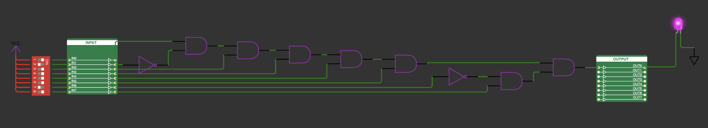

  

# BinaryDoorLock

## The goal 
of this little project was it to become familiar with the process of designing a **real chip** with [https://tinytapeout.com](https://tinytapeout.com/)

## The Idea
was it to build a simple BinaryDoorLock with 8-Bits as input.  
With 8 Bits there are 256 possible combinations which can be switched on with the input switches. 
Only one combination opens the BinaryDoorLock by setting the output pin high. The design was made with [WOKWI](https://wokwi.com/projects/359387860730498049)

The following sections are copied from the original [TinyTapeout](https://tinytapeout.com) template [README.md](https://github.com/TinyTapeout/tt03-submission-template/blob/main/README.md)

# What is Tiny Tapeout?

TinyTapeout is an educational project that aims to make it easier and cheaper than ever to get your digital designs manufactured on a real chip!

Go to https://tinytapeout.com for instructions!

## How to change the Wokwi project

Edit the [info.yaml](info.yaml) and change the wokwi_id to match your project.

## How to enable the GitHub actions to build the ASIC files

Please see the instructions for:

* [Enabling GitHub Actions](https://tinytapeout.com/faq/#when-i-commit-my-change-the-gds-action-isnt-running)
* [Enabling GitHub Pages](https://tinytapeout.com/faq/#my-github-action-is-failing-on-the-pages-part)

## How does it work?

When you edit the info.yaml to choose a different ID, the [GitHub Action](.github/workflows/gds.yaml) will fetch the digital netlist of your design from Wokwi.

After that, the action uses the open source ASIC tool called [OpenLane](https://www.zerotoasiccourse.com/terminology/openlane/) to build the files needed to fabricate an ASIC.

## Resources

* [FAQ](https://tinytapeout.com/faq/)
* [Digital design lessons](https://tinytapeout.com/digital_design/)
* [Learn how semiconductors work](https://tinytapeout.com/siliwiz/)
* [Join the community](https://discord.gg/rPK2nSjxy8)

## What next?

* Share your GDS on Twitter, tag it [#tinytapeout](https://twitter.com/hashtag/tinytapeout?src=hashtag_click) and [link me](https://twitter.com/matthewvenn)!
